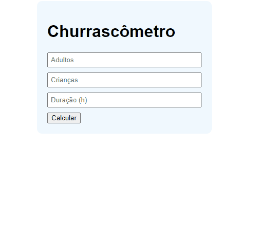
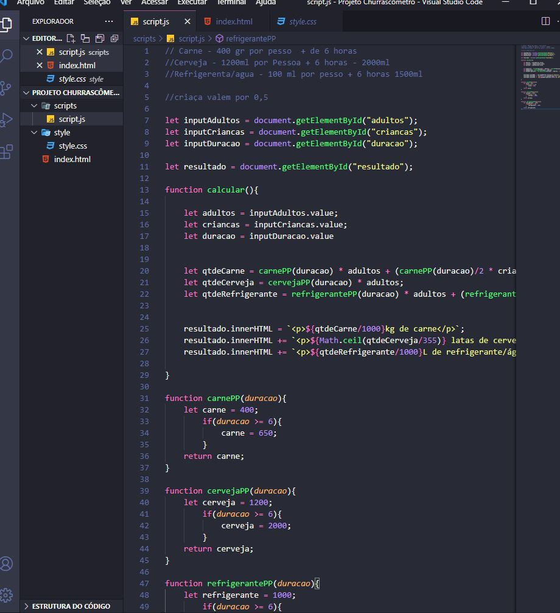

   

   <h3> 🥩 Calcule as bebidas e a carne do seu churrasco!🔥 </h3>
  

  

	
  

  

  

  
  

  
  ## Churrascômetro

Desafio/Projeto do curso Programador BR com o objetivo de fazer um sistema em JavaScript que calcula a quantidade necessária de carne e bebidas para um churrasco.

## 🛠️ Tecnologias

💻 HTML

💻 CSS

💻 JavaScript

## :camera: Veja:

### 🖥️ Desktop

### ☑️ Código:

##💻  Curso programadorBr

Recomendo muito o curso **ProgramadorBr** Tenho aprendido muito nessas últimas semanas e o curso tem sido fundamental para o meu aprendizado.

